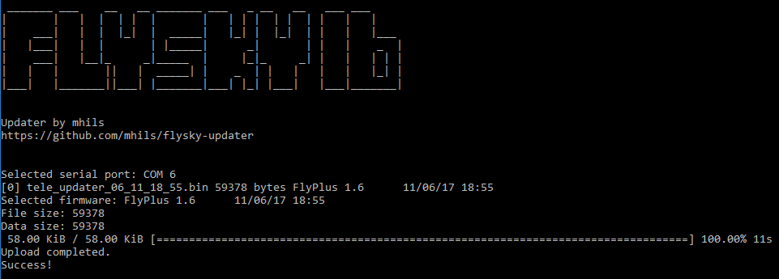
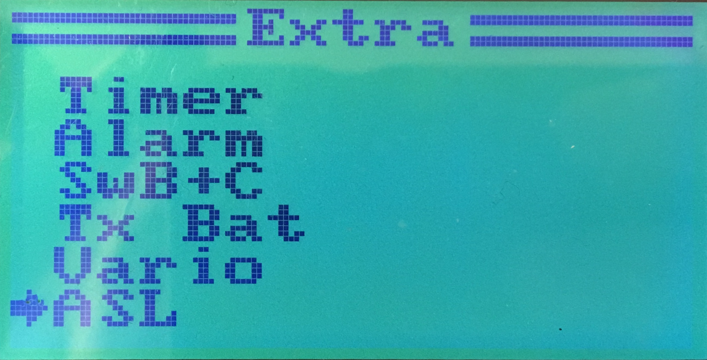
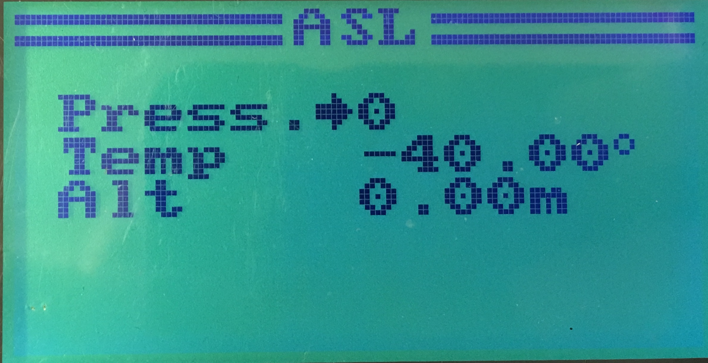
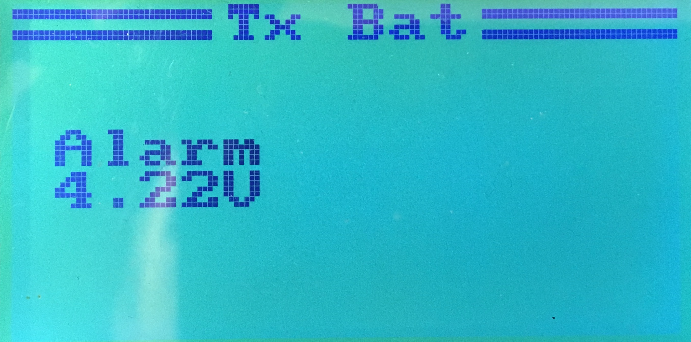
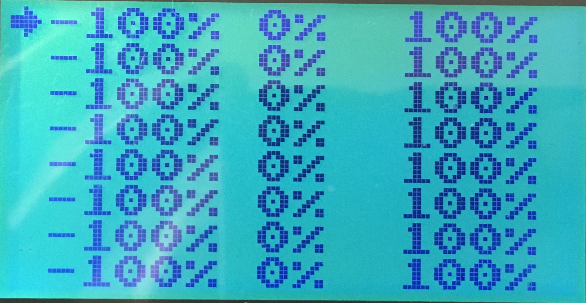

# FlySky I6 
Project description:

Firmware modification for the FlySky i6 based on modified firware developed by dave borthwick.

Latest version available on Release page:

https://github.com/qba667/FlySkyI6/releases

Oryginal multiplatform updater by mhils:

https://github.com/mhils/flysky-updater

Improved version:
* Handling file size correctly
* Autodetection of serial ports
* Autodetection of FW files

28 bytes telemetry data only with IA6B after patching - firmware can be found in my other repository.
There is also version sending IBus channel data and telemetry on same wire (serial port):

https://github.com/qba667/MAVLinkToIbus/tree/master/IA6B

How to update firmware can be found in povlhp repository. 
https://github.com/povlhp/FlySkyRxFirmware

New FW can be copied to update directory - updater will detect it automatically.

Steps to update:
1. Download, extract latest revision of the mod
2. Enter firmware update mode - from menu or by moving 2 trims to center
3. Run Updater - select serial port if necessary

In case if you want to support the project and reward me the time I spent on the FW please click this affiliate link when shopping at Banggood - It is free for you, but I will get reward from Banggood: 

https://www.banggood.com/?p=SB06021048261201501J

The project is Free Software and is made available free of charge. Your donation, which is purely optional.
If you like the software, you can also consider a donation.
All donations are greatly appreciated!

Extra menu
===

Timer
---
Menu "system->Extra->Timer"

Configuration:
Arrow should be pointing at Channel. Press UP or DOWN to pick a channel to use to trigger the timer. Usually you should chose Channel 3, the throttle channel (which displays on the screen with no space, so don't confuse it for Channel 13!) Press OK.

Arrow should be pointing at Value. Press UP or DOWN to pick a stick value to trigger the alarm. The timer will start when the channel exceeds the number chosen. 1000 roughly correlates to the stick being all the way down or left, 1500 roughly correlates to center stick, and 2000 roughly correlates to stick fully up or right. Trims and subtrims will affect the exact stick location, and servo reverse will change threshold direction. The value 1250 shall be considered as correct one - the throttle stick which triggers the timer at about 1/4 throttle. 
NOTE: The first time in FW < 1.7.2 the numbers are set they start at some really high number like 65,535 or something. Long hold OK and the value will be reset to zero. 
The you can increment up to the desired value. The numbers increment by 10 per up press.
When you have the desired number set, press OK.

Arrow should be pointing at Alarm. Use UP or DOWN to choose a desired timer duration. 
Here again in FW < 1.7.2 the very first time you set the time, it starts at some really high number, and you just have to long hold OK and the value will reset to 00:00:00. The display is in HH:MM:SS, and changes by 10 seconds for each UP or DOWN press. When you have the desired run time entered long hold CANCEL to store. 

Then short press CANCEL several times to back out of all menus and return to the main flight display.

Operation: 
In FW < 1.7.0:
You only get one timer setting to share among all model memories, so if different models require different times, you'll have to reset the timer for each model.
In FW >= 1.7.0:
Timer settings are no more shared between models.

When your trigger channel exceeds the trigger threshold, the timer on the flight display will start counting up. When the counter reaches the preset time, the alarm will sound.

If you trigger the timer by accident before you are ready, long press on CANCEL to reset the timer to 00:00:00. If the trigger channel is below the threshold, the timer will stay at 00:00:00 until triggered. If the trigger channel is above the threshold, the timer will reset to 00:00:00 then start counting up again.

When the timer is counting up, a long press on OK will bring up the System/Settings menu and pause the timer. You can continue to fly as normal and the timer will be paused. When you press CANCEL, the flight display will return and the counter will start counting again.

Once the alarm time is reached, the radio will beep once approximately every two seconds. To silence the alarm, long press CANCEL, and the timer will reset to zero and the alarm will be silenced. If the trigger channel is above the threshold, the timer will immediately begin counting again, otherwise it will stay at 00:00:00 until the trigger channel is moved above the threshold.

Alarm
---
Menu "system->Extra->alarm"

Select measurement, greater or less than and finally the value to check.

SWB+C
---

ASL
---
Menu "system->Extra->ASL"

TX battery monitoring
---
Menu "system->Extra->Tx Bat"

Current firmware has no longer a battery gauge in the upper right corner, instead a voltage reading is being used.
It is possible to change voltage alarm threshold to any number, by going into Extra>TX Bat. 
The value can be adjusted to use 1S/2S LiPo batteries.
If you use NiCds or NiMH, you can lower the voltage threshold to whatever you feel is best.

Vario
---
Menu "system->Extra->Vario"

Vario monitors a selected sensor (the first item in the menu),
and provides an accoustic feedback representing the change of the sensor value.
When the value changes, the firmware beeps accordingly: there
is a very short beep with 1200 Hz frequency providing a baseline,
and a longer second beep representing the sensor value difference.
Sensor value increase since the last beep yield higher frequency
(up to 2400 Hz), and the value decrease yields lower frequency (down to 600 Hz).

The Gain value in the menu controls how much the sensor value difference
affects the frequency. The higher gain means higher frequency difference for
the same sensor value difference. The Gain value in this menu can be set from
0 to 15. The gain of 3 represents the baseline - sensor difference of +1
means the sound frequency difference of 1 Hz when the value increases,
and 0.5 Hz when it decreases (we have 1200 Hz range on the plus side, but only
600 Hz on the minus side - it is a poor man's way to approximate the
logarithmic nature of the sound frequency :-) Each step in the Gain value
means twice as big (or half as big) frequency response. It means, with
Gain set to 0 the sensor value difference of +8 means frequency of 1201 Hz,
with Gain of 6 the sensor value difference of +1 means frequency of 1208 Hz,
and so on.

The raw sensor values are used. So for example, the altitude sensor's raw
value is in centimeters. When the Gain is set to 5 (which is what Yenya
uses), an altitude difference of +1 m means the second beep at 1600 Hz,
and an altitude difference of -1 m means the second beep at 1000 Hz.

See [https://github.com/Yenya/ibus-altitude-sensor](here) for DYI Arduino-based
altitude, temperature, and battery voltage sensor. 

Endpoints
---
Menu "system->Extra->Endpoints"

Three columns with subtrim and Endpoint settings for channel 7-14

The structure is the following:

`Channel 07 [Min limit][Subtrim][Max limit]`

`Channel 08 [Min limit][Subtrim][Max limit]`

`Channel 09 [Min limit][Subtrim][Max limit]`

`Channel 10 [Min limit][Subtrim][Max limit]`

`Channel 11 [Min limit][Subtrim][Max limit]`

`Channel 12 [Min limit][Subtrim][Max limit]`

`Channel 13 [Min limit][Subtrim][Max limit]`

`Channel 14 [Min limit][Subtrim][Max limit]`

Default values are set to (min = -100%, subtrim = 0, max = 100%);

Min, max and subtrim can be positive or negative there is no restriction - the only restriction is:
`Min < subtrim <max`

PPM Input
---
An external source of channel data can be connected to the trainer port on the back side of the transmitter (the PS/2 port)

<picture of trainer port and pinout>

The channels are then mapped to aux channels PPM4, PPM5, PPM6 which can be configured to real channels in the aux-channel assignment menu.

Configuration is possible for channels from original implementation (channels 5-6) as well as for channels 7-14.
In case of newer receivers PPM output is also active for channels 7-8. 
All configured values are also exposed as IBUS/SBUS values.

To configure channels 11-14 on Aux. channels page keep pressing "OK" button. 

Valid PPM input should contain 6 channels if 8 channels variant is being used channels 7-8 will overlap channels 1-2.

